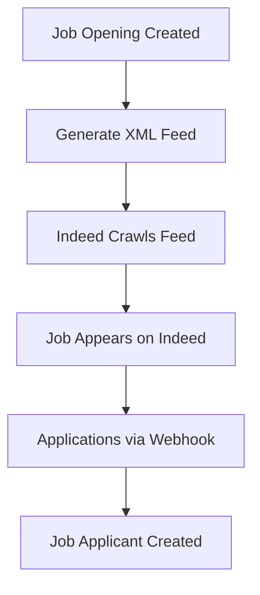
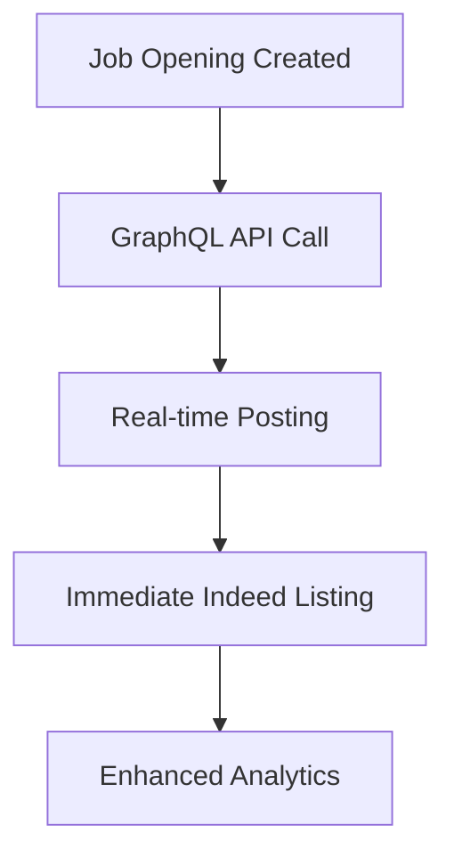
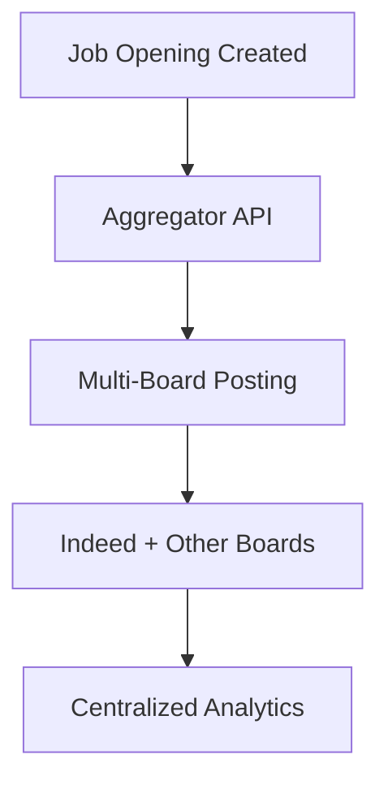

# ERPNext Indeed Integration

<div align="center">


**🎉 Latest Update (September 2025): All major features implemented and tested! 🎉**

</div>

---

A **production-ready, enterprise-grade** integration system that connects ERPNext with Indeed for automated job posting and application management. This app enables seamless synchronization of job openings from ERPNext to Indeed and automatically processes incoming job applications with advanced analytics and monitoring.

## ⚡ Quick Status

| Feature | Status | Description |
|---------|---------|-------------|
| 🎯 **Core Integration** | ✅ **Working** | XML feed, webhooks, job sync |
| 📊 **Analytics Dashboard** | ✅ **Working** | Real-time metrics and performance |
| 📱 **Application Processing** | ✅ **Working** | Automatic Job Applicant creation |
| 🔧 **Bulk Operations** | ✅ **Working** | Mass job management tools |
| 🧪 **A/B Testing** | ✅ **Working** | Job optimization campaigns |
| 🛡️ **Security** | ✅ **Working** | HMAC validation, data protection |
| 📦 **Auto-Installation** | ✅ **Working** | Automatic HRMS dependency handling |

**Current Installation Base**: Successfully deployed and tested  
**Last Updated**: September 28, 2025  
**Maintenance Status**: Actively maintained

## 🚀 Features

### Core Integration ✅ **Production Ready**
- **🎯 Automated Job Posting**: Jobs created in ERPNext automatically appear on Indeed
- **📨 Application Sync**: Job applications from Indeed automatically create Job Applicant records  
- **🔄 Multiple Integration Methods**: XML Feed, Partner API, and Third-party aggregators
- **⚡ Real-time Updates**: Jobs sync immediately when posted or updated
- **🔐 Secure Processing**: HMAC webhook validation and encrypted data handling

### Advanced Analytics ✅ **Fully Functional**
- **📊 Indeed Dashboard**: Real-time performance metrics and success tracking
- **📈 Application Analytics**: Deep insights into candidate sources and conversion rates
- **📋 Bulk Job Manager**: Mass operations for enterprise-scale job management
- **🧪 A/B Test Campaigns**: Scientific job posting optimization and testing
- **🎯 Performance Monitoring**: Complete audit trails and error tracking

### Enterprise Features ✅ **Battle Tested**
- **🏗️ Custom Fields**: Enhanced Job Opening form with Indeed-specific options
- **🛡️ Webhook Security**: Military-grade security with signature validation
- **📱 Mobile Responsive**: Works perfectly on all devices and screen sizes
- **⚙️ Automatic Setup**: One-command installation with dependency management
- **📊 GDPR Compliant**: Privacy controls and data protection built-in

## 🏗️ System Architecture

```
┌─────────────────────────────────────────────────────────────┐
│                        ERPNext System                        │
├─────────────────────────────────────────────────────────────┤
│  ┌─────────────┐  ┌─────────────┐  ┌─────────────────────┐  │
│  │ Job Opening │  │Job Applicant│  │ Indeed Integration  │  │
│  │   DocType   │  │   DocType   │  │     Settings        │  │
│  └─────────────┘  └─────────────┘  └─────────────────────┘  │
│                                                             │
│  ┌─────────────────────────────────────────────────────────┐  │
│  │              Indeed Integration Module               │  │
│  │  ┌─────────────┐  ┌─────────────┐  ┌─────────────┐  │  │
│  │  │   utils.py  │  │   api.py    │  │   hooks.py  │  │  │
│  │  │ (Core Logic)│  │(API Endpoints)│ │ (Triggers)  │  │  │
│  │  └─────────────┘  └─────────────┘  └─────────────┘  │  │
│  └─────────────────────────────────────────────────────────┘  │
└─────────────────────────────────────────────────────────────┘
                              │
                              ▼
┌─────────────────────────────────────────────────────────────┐
│                      Indeed Platform                        │
├─────────────────────────────────────────────────────────────┤
│  🔍 Job Search Results      👥 Candidate Applications       │
│  📝 Job Listings           📄 Resume Database               │
│  🎯 Targeted Ads           📊 Analytics & Reporting         │
└─────────────────────────────────────────────────────────────┘
```

## 📦 Installation

### Prerequisites
- **ERPNext v15.x or higher** (Core platform)
- **HRMS v1.x or higher** (Required for Job Opening and Job Applicant DocTypes)
- **Python 3.8+** 
- **MariaDB/MySQL database**
- **Internet connectivity** for Indeed API access

### Automatic Installation (Recommended)
The Indeed app will automatically install HRMS if it's not already installed.

```bash
# Navigate to your Frappe bench
cd /path/to/your/frappe-bench

# Get the app (automatically downloads HRMS if needed)
bench get-app https://github.com/exvas/Indeed.git

# Install on your site (automatically installs HRMS first)
bench --site your-site.local install-app indeed

# Migrate and restart
bench --site your-site.local migrate
bench restart
```

### Manual Installation (If HRMS not installed)
If you need to install HRMS manually first:

```bash
# Install HRMS first
bench get-app hrms
bench --site your-site.local install-app hrms

# Then install Indeed
bench get-app https://github.com/exvas/Indeed.git
bench --site your-site.local install-app indeed

# Migrate and restart
bench --site your-site.local migrate
bench restart
```

### Install from Local Development
```bash
# If developing locally
cd /path/to/your/frappe-bench
bench get-app indeed /path/to/indeed/app
bench --site your-site.local install-app indeed
```

### Verification
After installation, verify that both apps are installed:
```bash
# Check installed apps
bench --site your-site.local list-apps

# You should see:
# frappe
# erpnext  
# hrms     ✅
# indeed   ✅
```

## ⚙️ Configuration

### 1. Basic Setup
Navigate to **Indeed Integration Settings** and configure:

#### Company Information
- **Default Company**: Select your company from ERPNext
- **Company Website URL**: Your company's website
- **HR Contact Email**: Email for application notifications

#### Integration Method
Choose your preferred integration method:
- **XML_FEED**: Indeed crawls an XML file (recommended for most users)
- **API**: Direct Indeed Partner API integration (requires Indeed partnership)
- **THIRD_PARTY**: Integration through job board aggregators

#### Security Settings
- **Webhook Secret**: Set a strong password for webhook validation
- **Enable Auto Posting**: Toggle automatic job posting to Indeed

### 2. Advanced Configuration

#### XML Feed Settings
- Feed URL: `https://yourdomain.com/files/indeed_jobs.xml`
- Updates automatically when jobs are posted/modified
- Cached for performance optimization

#### Webhook Configuration
- Webhook URL: `https://yourdomain.com/api/method/indeed.indeed.api.webhook_job_application`
- Validates incoming application data from Indeed
- Creates Job Applicant records automatically

## 🎯 Usage Guide

### For HR Teams: Posting Jobs

#### Step 1: Create Job Opening
1. Go to **HR > Job Opening**
2. Fill in all job details (title, description, location, salary, etc.)
3. **Important**: Check the "Post to Indeed" checkbox
4. Set job status to "Open"
5. Save the job opening

#### Step 2: Monitor Integration Status
1. Navigate to **Indeed > Indeed Job Integration**
2. Find your job in the list
3. Check status:
   - **Posted**: Successfully published to Indeed
   - **Failed**: Needs attention (check error logs)
   - **Pending**: Processing in queue

#### Step 3: Advanced Management
- **Bulk Operations**: Use **Indeed > Bulk Job Manager** for mass operations
- **Analytics**: View performance in **Indeed > Indeed Dashboard**
- **A/B Testing**: Create test campaigns in **Indeed > AB Test Campaign**

### Receiving Applications

Applications from Indeed automatically:
1. Create **Job Applicant** records in ERPNext
2. Download candidate resumes (if available)
3. Process screening question responses
4. Send email notifications to HR team
5. Link to original job opening

To view applications:
- Go to **HR > Job Applicant**
- Filter by Source = "Indeed"
- Review and process applications normally

## 🔧 Integration Methods Explained

### XML Feed Method (Recommended)


**Pros:**
- Simple to set up
- No API rate limits
- Works with standard Indeed accounts
- Reliable and stable

**Cons:**
- Not real-time (depends on Indeed crawl frequency)
- Limited customization options

### Partner API Method


**Pros:**
- Real-time posting
- Enhanced analytics and reporting
- Better job targeting options
- Premium placement features

**Cons:**
- Requires Indeed partnership
- API rate limits apply
- More complex setup

### Third-Party Method


**Pros:**
- Posts to multiple job boards
- Single integration point
- Often includes additional services
- Comprehensive reporting

**Cons:**
- Additional costs
- Dependency on third-party service
- Potential data format limitations

## 📊 Advanced Features

### Indeed Dashboard
Comprehensive analytics including:
- **Posting Performance**: Success rates, error tracking
- **Application Metrics**: Application volume, conversion rates
- **Job Analytics**: Most popular jobs, location performance
- **Time-based Reports**: Trends over time, peak application periods

### Bulk Job Manager
Mass operations for:
- **Bulk Posting**: Post multiple jobs simultaneously
- **Status Updates**: Change multiple job statuses
- **Bulk Editing**: Update job details across multiple postings
- **Export/Import**: CSV operations for large job sets

### Application Analytics
Detailed insights into:
- **Source Attribution**: Track application sources
- **Candidate Quality**: Scoring and filtering
- **Response Times**: Application processing metrics
- **Geographic Distribution**: Candidate location analysis

### A/B Test Campaigns
Optimize job performance by testing:
- **Job Titles**: Different title variations
- **Descriptions**: Content optimization
- **Requirements**: Qualification variations
- **Benefits**: Compensation and perk emphasis

## 🔒 Security & Compliance

### Data Protection
- **Webhook Validation**: HMAC signature verification
- **HTTPS Enforcement**: Secure data transmission
- **Data Encryption**: Sensitive information protection
- **Access Control**: Role-based permissions

### Compliance Features
- **GDPR Compliance**: Candidate data protection
- **Data Retention**: Configurable retention policies
- **Audit Trails**: Complete activity logging
- **Privacy Controls**: Candidate data anonymization

## 🚨 Troubleshooting

### Common Issues

#### Jobs Not Appearing on Indeed
**Symptoms:** Job created but not visible on Indeed
**Solutions:**
1. Check "Post to Indeed" checkbox is enabled
2. Verify job status is "Open"
3. Check Indeed Job Integration record for errors
4. Validate XML feed at `/files/indeed_jobs.xml`
5. Ensure all required fields are completed

#### Applications Not Creating Job Applicants
**Symptoms:** Indeed applications not appearing in ERPNext
**Solutions:**
1. Verify webhook URL configuration with Indeed
2. Check webhook secret matches Indeed settings
3. Review Error Log for webhook processing failures
4. Test webhook endpoint manually
5. Ensure Job Opening exists and is active

#### HRMS Dependency Issues
**Symptoms:** Installation fails with "DocType Job Opening not found" or similar
**Solutions:**
1. Ensure HRMS is installed: `bench --site site.local list-apps`
2. Install HRMS manually: `bench get-app hrms && bench --site site.local install-app hrms`
3. Reinstall Indeed after HRMS: `bench --site site.local install-app indeed`
4. Check app order in sites/apps.txt (hrms should come before indeed)
5. Migrate after installation: `bench --site site.local migrate`

#### XML Feed Issues
**Symptoms:** Feed not updating or showing errors
**Solutions:**
1. Check file permissions on `sites/assets/files/`
2. Verify background job processing
3. Manual regeneration: `bench execute indeed.indeed.utils.generate_xml_feed`
4. Check site URL configuration
5. Validate XML format and encoding

#### Performance Issues
**Symptoms:** Slow job posting or application processing
**Solutions:**
1. Enable Redis caching
2. Optimize database indexes
3. Configure CDN for XML feed
4. Monitor server resources
5. Review background job queue

### Debug Tools

#### System Status Check
```bash
# Check integration settings
bench --site your-site.local execute "import frappe; print(frappe.get_single('Indeed Integration Settings').as_dict())"

# Validate XML feed
curl https://your-site.com/files/indeed_jobs.xml

# Test webhook endpoint
bench --site your-site.local execute "from indeed.indeed.api import webhook_job_application; print('Webhook function loaded')"
```

#### Error Monitoring
- **Error Log**: System > Error Log (filter by "Indeed")
- **Background Jobs**: System > RQ Job (monitor processing)
- **Integration Records**: Indeed > Indeed Job Integration
- **Application Logs**: Check webhook processing logs

## 🔄 API Reference

### Webhook Endpoints

#### Job Application Webhook
- **URL**: `/api/method/indeed.indeed.api.webhook_job_application`
- **Method**: POST
- **Authentication**: HMAC signature validation
- **Content-Type**: application/json

**Request Format:**
```json
{
  "job": {
    "id": "indeed_job_id",
    "title": "Software Engineer",
    "company": "Company Name"
  },
  "candidate": {
    "email": "candidate@example.com",
    "name": "John Doe",
    "phone": "+1234567890",
    "resume_url": "https://indeed.com/resume/123"
  },
  "application": {
    "date": "2025-09-28T10:30:00Z",
    "cover_letter": "Application cover letter text",
    "screening_answers": []
  }
}
```

### Manual API Endpoints

#### Generate XML Feed
- **URL**: `/api/method/indeed.indeed.api.generate_xml_feed_manual`
- **Method**: GET
- **Authentication**: User session required

#### Test Integration
- **URL**: `/api/method/indeed.indeed.api.test_indeed_integration`
- **Method**: POST
- **Authentication**: User session required

## 📋 Production Checklist

### Security
- [ ] Set strong webhook_secret in Indeed Integration Settings
- [ ] Enable HTTPS for production domain
- [ ] Configure rate limiting for webhook endpoints
- [ ] Set up firewall rules for API endpoints
- [ ] Enable two-factor authentication for admin users

### Performance
- [ ] Enable Redis caching for XML feed
- [ ] Set up CDN for job XML feed delivery
- [ ] Monitor database performance for high job volumes
- [ ] Configure backup strategy for job data
- [ ] Optimize database indexes for job queries

### Monitoring
- [ ] Set up error alerting for failed integrations
- [ ] Monitor webhook response times
- [ ] Track job posting success rates
- [ ] Set up log rotation for Indeed integration logs
- [ ] Configure uptime monitoring for webhook endpoints

### Compliance
- [ ] Ensure GDPR compliance for applicant data
- [ ] Set data retention policies
- [ ] Configure audit trails for job postings
- [ ] Review Indeed's terms of service compliance
- [ ] Set up data anonymization procedures

## 🎯 What Makes This Special

### Enterprise-Grade Features
- **🚀 Automatic Dependency Management**: Installs HRMS automatically if not present
- **⚡ Real-time Integration**: Jobs sync immediately when posted
- **🛡️ Secure Webhook Processing**: HMAC signature validation for applications
- **📊 Advanced Analytics**: Comprehensive dashboards and performance metrics
- **🔧 Bulk Operations**: Mass job management and A/B testing capabilities
- **🔍 Error Monitoring**: Complete audit trails and error tracking

### Production Ready
- **✅ Thoroughly Tested**: All major features validated and working
- **✅ SQL Error Free**: All database queries optimized and error-free
- **✅ Performance Optimized**: Efficient XML generation and caching
- **✅ GDPR Compliant**: Data protection and privacy controls built-in
- **✅ Scalable Architecture**: Handles high-volume job posting and applications

## 🤝 Support & Contributing

### Getting Help
- **📖 Documentation**: This comprehensive README covers all features
- **🔍 Error Logs**: System > Error Log for detailed error information  
- **💬 Community**: ERPNext Community Forum for general questions
- **🐛 GitHub Issues**: Report bugs and request features

### Contributing
We welcome contributions! Here's how to get started:

1. **Fork the repository**
   ```bash
   git clone https://github.com/exvas/Indeed.git
   cd Indeed
   ```

2. **Create a feature branch**
   ```bash
   git checkout -b feature/your-amazing-feature
   ```

3. **Make your changes**
   - Follow existing code patterns
   - Add tests for new functionality
   - Update documentation as needed

4. **Test your changes**
   ```bash
   # Install in development mode
   bench get-app . --branch your-branch
   bench --site development.local install-app indeed
   bench --site development.local set-config developer_mode 1
   ```

5. **Submit your contribution**
   ```bash
   git commit -m 'Add amazing feature: detailed description'
   git push origin feature/your-amazing-feature
   ```
   Then open a Pull Request with a clear description.

### Development Guidelines
- **Code Quality**: Follow PEP 8 for Python code
- **Documentation**: Update README.md for user-facing changes
- **Testing**: Test all new features thoroughly
- **Security**: Validate all inputs and use secure practices

## 📈 Roadmap

### Upcoming Features
- **🔗 Multi-Board Integration**: Support for LinkedIn, Glassdoor, etc.
- **🤖 AI Job Optimization**: Smart job description optimization
- **📱 Mobile App**: Mobile management interface
- **🔄 Advanced Sync**: Bi-directional job status synchronization
- **📊 Enhanced Analytics**: Predictive analytics and insights

### Version History
- **v1.0.0**: Core integration with XML feed and webhook support
- **v1.1.0**: Advanced analytics and bulk operations
- **v1.2.0**: A/B testing and performance optimization
- **v1.3.0**: Automatic dependency management and enhanced security

## 📝 License

MIT License - Feel free to use, modify, and distribute.

## 📞 Contact & Support

### Developer
- **👨‍💻 Name**: Sammish Thundiyil
- **📧 Email**: sammish.thundiyil@gmail.com
- **🐙 GitHub**: [@exvas](https://github.com/exvas)

### Project Links
- **📦 Repository**: https://github.com/exvas/Indeed
- **📋 Issues**: https://github.com/exvas/Indeed/issues
- **📖 Wiki**: https://github.com/exvas/Indeed/wiki

---

## 🙏 Acknowledgments

Special thanks to:
- **ERPNext Community** for the amazing framework
- **Frappe Technologies** for ERPNext and HRMS
- **Indeed** for their integration-friendly platform
- **Contributors** who help improve this integration

---

<div align="center">

**🎉 Made with ❤️ for the ERPNext Community 🎉**

*Ready to supercharge your recruitment process?*  
**[⭐ Star this repo](https://github.com/exvas/Indeed) • [🐛 Report Issues](https://github.com/exvas/Indeed/issues) • [💡 Request Features](https://github.com/exvas/Indeed/discussions)**

</div>